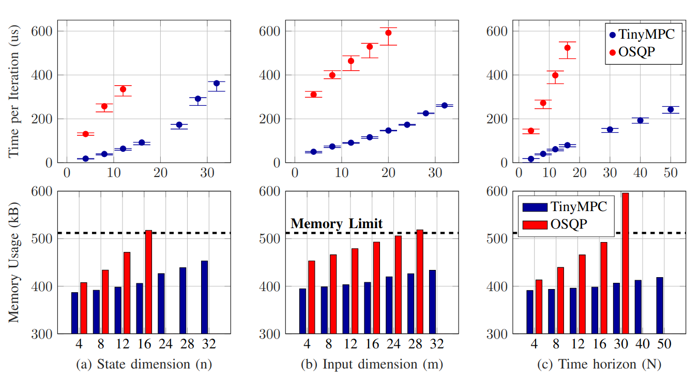

# Welcome to TinyMPC's documentation!

<!-- 
 -->
<p align="center">
  
  
</p>
<p align="center">
  
</p>

!!! success "" 

    🏆 TinyMPC has been selected as a finalist for Best Conference Paper Award, Best Student Paper Award, and Best Paper Award in Automation at [IEEE ICRA 2024](https://2024.ieee-icra.org/)! Thank you to everyone who has used TinyMPC and provided feedback!


TinyMPC is an open-source optimization solver tailored for convex model-predictive control, delivering high speed and low memory footprints. Implemented in pure C/C++ with minimal dependencies, this solver is particularly well-suited for embedded control and robotics applications on resource-constrained platforms. Additionally, we provide user-friendly interfaces for seamless integration with high-level languages such as Python, MATLAB, Julia.

[Get Started :material-arrow-right-box:](get-started/examples.md){.md-button}
[ICRA Paper :simple-arxiv:](https://arxiv.org/abs/2310.16985){:target="_blank" .md-button}
[CDC Paper :simple-arxiv:](https://arxiv.org/abs/2403.18149){:target="_blank" .md-button}
[Watch the Video :fontawesome-brands-youtube:](https://www.youtube.com/watch?v=NKOrRyhcr6w){:target="_blank" .md-button}

## Robot Demonstrations

Integrating TinyMPC into computationally underpowered robots enables them to execute agile maneuvers and exhibit safe behaviors.

### Dynamic obstacle avoidance

TinyMPC runs fast enough to enable re-linearizing constraints at each time step, allowing it to reason about moving obstacles, as it is doing in both videos. The algorithm can additionally handle any number of arbitrary linear constraints. On the right, for example, it is avoiding the end of the stick while staying in the yz plane.

<video width="100%" preload="auto" muted autoplay controls loop style="border: 0px solid #bbb; border-radius: 10px; width: 100%;">
    <source src="media/favoid.mp4" type="video/mp4">
</video>

### Extreme pose recovery

TinyMPC can enable recovering from extreme initial conditions. In this example, it is compared against three of the [Crazyflie 2.1](https://www.bitcraze.io/products/crazyflie-2-1/){:target="_blank"}'s stock controllers. Only TinyMPC was able to keep the control inputs under the drone's limits, and the recovery looks pretty good!

<video width="100%" preload="auto" muted autoplay controls loop style="border: 0px solid #bbb; border-radius: 10px; width: 100%;">
    <source src="media/fextreme.mp4" type="video/mp4">
</video>

### Figure-8 tracking

We compared against the same stock controllers for an infeasible figure-8 tracking task (the time given to complete a single figure-8 could only be met if the drone was much more powerful). TinyMPC and PID were able to stay upright, but TinyMPC's trajectory more closely resembled a figure-8.

<video width="100%" preload="auto" muted autoplay controls loop style="border: 0px solid #bbb; border-radius: 10px; width: 100%;">
    <source src="media/fig82.mp4" type="video/mp4">
</video>

## Microcontroller Benchmarks

<<<<<<< HEAD
TinyMPC outperforms state-of-the-art solvers in terms of speed and memory footprint on microcontroller benchmarks (smaller is better). 


### QP problems 

TinyMPC and OSQP were benchmarked with random QP-based MPC problems of different sizes on a Teensy 4.1 board.

<p align="center">
  
</p>

### SOCP problems

Left, TinyMPC and OSQP were benchmarked with QP-based predictive safety filtering problems of different sizes on a STM32F405 Feather board.
Right, TinyMPC, ECOS and SCS were benchmarked with SOCP-based rocket soft-landing MPC problems of different sizes on a Teensy 4.1 board.

<p align="center">
  
</p>

### Early termination 

TinyMPC, ECOS and SCS were benchmarked with SOCP-based rocket soft-landing MPC problems with early termination on a Teensy 4.1 board.

<p align="center">
  
</p>
=======
---

<figure markdown="span">
    { width=60% align=right }
    <div style="text-align: left;">
        TinyMPC outperforms state-of-the-art solvers in terms of speed and memory footprint on microcontroller benchmarks. Here, we solve randomly generated QP MPC problems and compare iteration times and memory footprint against [OSQP](https://osqp.org/){:target="_blank"}. Because TinyMPC takes advantage of the specific structure of the MPC problem, the amount of data it stores scales linearly instead of quadratically with each dimension. This allows it to store much bigger problems (and solve them much faster) than generic QP solvers such as OSQP.
    </div>
</figure>

---

<figure markdown="span">
    { width=60% align=left}
    <div style="text-align: left;">
        TinyMPC is now also capable of handling conic constraints! In (b), we benchmarked TinyMPC against two existing conic solvers with embedded support, [SCS](https://www.cvxgrp.org/scs/){:target="_blank"} and [ECOS](https://web.stanford.edu/~boyd/papers/ecos.html){:target="_blank"}, on the rocket soft-landing problem. Again, because of its lack of generality, TinyMPC is orders of magnitudes faster than SCS and ECOS.
    </div>
</figure>

---

<figure markdown="span">
    { width=40% align=right}
    <div style="text-align: left;">
        Since it's primary use is in real-time control, we also compared TinyMPC's trajectory tracking performance against SCS and ECOS on the rocket soft-landing problem. These tests assume the controller has $\text{Control Step}$ amount of time (in milliseconds) to solve the problem at every real time step (10 milliseconds). TinyMPC beats ECOS in this real-time task because of its ability to warm start each solve with the previous solution, and it performs more iterations per control step than SCS, allowing it to track the reference trajectory more reliably.
    </div>
</figure>

---

## Credits

<div class="grid cards" markdown>

-   

    

    Install [`mkdocs-material`](#) with [`pip`](#) and get up
    and running in minutes

    [:octicons-arrow-right-24: Getting started](#)

-   :fontawesome-brands-markdown:{ .lg .middle } __It's just Markdown__

    ---

    Focus on your content and generate a responsive and searchable static site

    [:octicons-arrow-right-24: Reference](#)

-   :material-format-font:{ .lg .middle } __Made to measure__

    ---

    Change the colors, fonts, language, icons, logo and more with a few lines

    [:octicons-arrow-right-24: Customization](#)

-   :material-scale-balance:{ .lg .middle } __Open Source, MIT__

    ---

    Material for MkDocs is licensed under MIT and available on [GitHub]

    [:octicons-arrow-right-24: License](#)

</div>

## Citing

```latex
@misc{tinympc,
      title={TinyMPC: Model-Predictive Control on Resource-Constrained Microcontrollers}, 
      author={Khai Nguyen and Sam Schoedel and Anoushka Alavilli and Brian Plancher and Zachary Manchester},
      year={2023},
      eprint={2310.16985},
      archivePrefix={arXiv},
      primaryClass={cs.RO}
}
```

```latex
@misc{tinympc-conic-codegen,
      title={Code Generation for Conic Model-Predictive Control on Microcontrollers with TinyMPC}, 
      author={Sam Schoedel and Khai Nguyen and Elakhya Nedumaran and Brian Plancher and Zachary Manchester},
      year={2024},
      eprint={2403.18149},
      archivePrefix={arXiv},
      primaryClass={cs.RO}
}
```
>>>>>>> f1d8ade (Add benchmark and citing info to front page)
